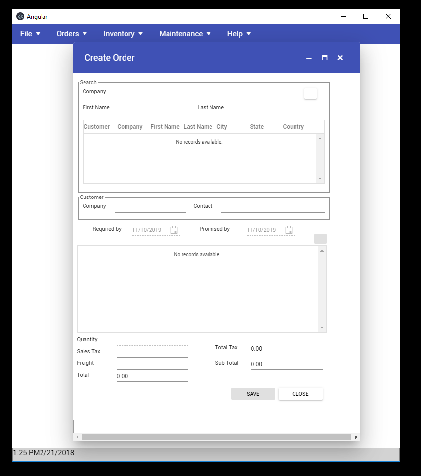

# Webmap and Electron

This repo provides an example of how to package your legacy VB6, Powerbuilder or Delphi applications modernized with WebMap to Windows and Mac Desktop apps using [Electron](https://electronjs.org/)

> Electron (formerly known as Atom Shell) is an open-source framework developed and maintained by GitHub. Electron allows for the development of desktop GUI applications using web technologies: It combines the Chromium rendering engine and the Node.js runtime. Electron is the main GUI framework behind several notable open-source projects including Atom, GitHub Desktop,[9] Light Table, Visual Studio Code, and WordPress Desktop

Using the [SKS demo](https://github.com/MobilizeNet/SKS) we will show how easy is this conversion.

Just follow these steps:

* Create a directory called Electron
* Switch to that directory
* Clone [SKS WebMap](https://github.com/MobilizeNet/SKSWebMap) running 

`git clone https://github.com/MobilizeNet/SKSWebMap.git`

* Clone [SKS Electron](https://github.com/MobilizeNet/SKSElectron) running

 `git clone https://github.com/MobilizeNet/SKSElectron.git`

 * Build binaries for Win64 and OSX. Swith to SKSWebMap and run:

 `dotnet publish -c Release -r osx-x64`

 `dotnet publish -c Release -r win-x64`

 * After compilation you will have two folders under `SKSWebMap\bin\Release\netcoreapp2.2` called `osx-x64` and `win-x64` copy these two folder to `SKSElectron\api`

 * Go to `SKSElectron` and run npm install

 * After instalation you can run `electron .` to test your app inside electron or run `electron-builder` to build your binaries for windows and mac

 > NOTE: on some computers the you need to run the `electron-builder` by running `node_modules\.bin\electron-builder`

 And that's all after that you will have a folder `Electron\dist` with an exe that is your installer for a Windows Desktop App. You can run the same on a Mac to build binaries fror OSX
 

